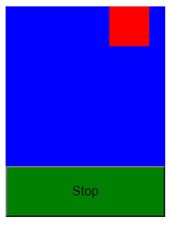
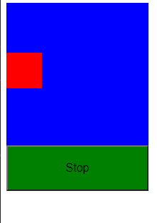

## Animación Sencilla en javascript

Animación con Javascript mover un figura cuadrada  dentro de otro figura cuadrada la animación comienza con la carga de la pagina, se detiene con una alerta de javascript.

Movimiento 1 izquierda a derecha rodear por parte azul

Movimiento 2 abajo a arriba rodear por parte azul

